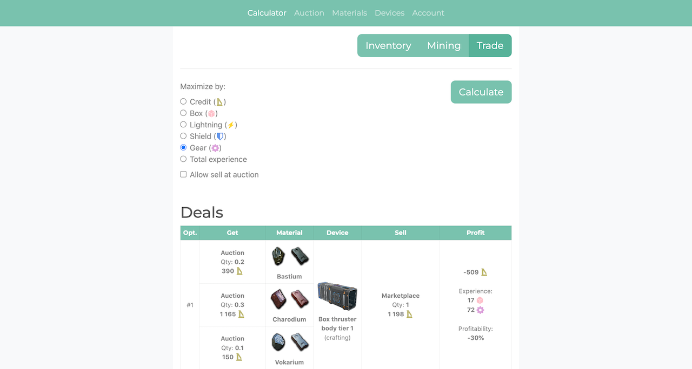
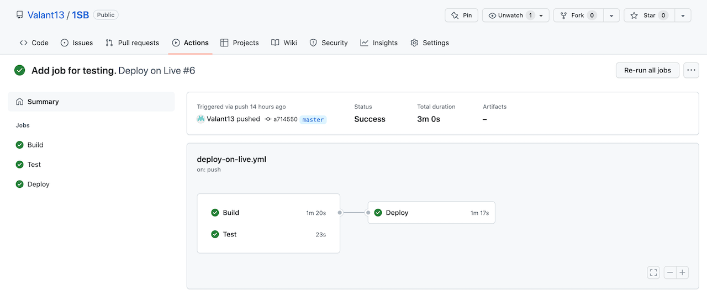

# Lab on software testing, verification and validation

> **Nikita Tychuk** IPZm-21-1

## Application

The work is based on my own home project written in PHP framework Symfony. The essence of the project is to simplify the
calculation of trade items in the Starbase online game. You can familiarize yourself with the application by the
following link: https://www.1sb-trader.club

## Configuration of CI/CD

Automated build, test, and deployment of the application was configured using GitHub Actions. The process is triggered
by push of the master branch or manually. Below you can see a detailed description of the jobs.

### Build

Builds code for the production and commits it to the live branch.

Steps:
* Switch on master
* Install PHP and Node
* Configure framework for production
* Install Composer and NPM dependencies
* Exclude generated code from Git ignore
* Recreate the live branch
* Commit code on the live branch and push it

### Test

Runs PHP unit tests. Requires development dependencies. Executes in a parallel with a building code for production.

Steps:
* Switch on master
* Install PHP
* Install Composer development dependencies
* Run unit tests

### Deploy

Executes deployment on live server. Needs successful execution of the build and test jobs.

Steps:
* Switch on live
* Define public IP of current runner
* Add this IP to the SSH whitelist on the live server
* Copy code to the live server via Rsync
* Run commands to clear cache and migrate database changes on the live server via SSH
* Remove IP from the SSH whitelist (do this even if previous steps failed)
